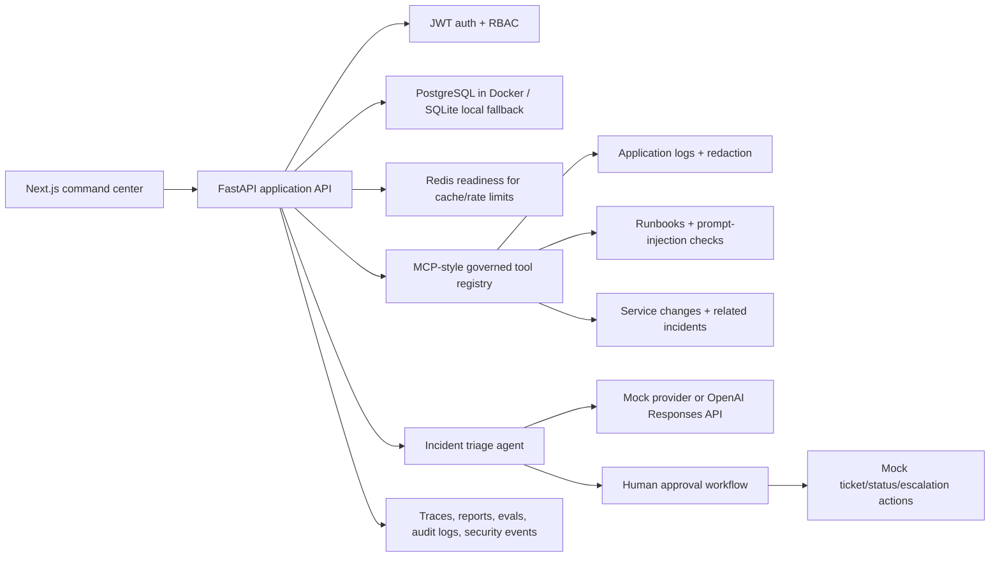

# Enterprise AI Incident Triage & Automation Agent

An enterprise-style, local-first incident response platform that uses an AI triage agent, MCP-style tools, RBAC, audit logs, approval gates, evaluations, and observability dashboards to investigate incidents end to end.

This is built as a real internal operations product: alerts become incidents, the agent gathers evidence through governed tools, likely root causes are scored, remediation and communication drafts are generated, risky actions pause for human approval, and every tool call, trace step, approval, report, and audit event is persisted.

## What This Demonstrates

- Agentic workflow design for SRE and DevOps incident response.
- FastAPI backend architecture with typed models, auth, RBAC, persistence, reports, evals, and auditability.
- MCP-style tool governance: tool registry, schemas, permissions, risk levels, enable/disable controls, approval requirements, and persisted tool calls.
- Security-aware AI system behavior: sensitive data redaction, prompt-injection detection, secret-safe reports, and human gates before actions.
- Deterministic local demo and tests, with optional OpenAI Responses API synthesis for richer incident summaries.
- Production-minded frontend UX: command center, traces, approvals, reports, evaluations, observability, security, and admin dashboards.

## Core Scenario

The seeded demo incident is a `checkout-api` payment timeout spike after a retry configuration change.

The workflow:

1. Load an alert-backed incident.
2. Classify severity.
3. Search redacted application logs.
4. Search runbooks and flag suspicious prompt-injection content.
5. Check service health.
6. Review recent service changes.
7. Find related historical incidents.
8. Generate root cause hypotheses and confidence scores.
9. Draft remediation, ticket, and internal status update artifacts.
10. Require incident commander/admin approval before mock external actions.
11. Persist timeline events, tool calls, traces, approvals, reports, eval results, and audit logs.

## Architecture



## Product Surfaces

- Incident dashboard and command center.
- Alert, service, log, runbook, and service-change views.
- MCP tools console and tool governance.
- Agent run history and trace viewer.
- Approval queue for commander/admin review.
- Mock action executor for approved local actions.
- Incident reports with redacted evidence.
- Evaluation dashboard for safety and quality checks.
- Admin analytics, observability, audit logs, users, tool calls, and security events.

## Tech Stack

Backend:

- FastAPI, Pydantic v2, SQLAlchemy 2, Alembic.
- PostgreSQL, Redis, SQLite local fallback.
- JWT authentication, password hashing, role-based access control.
- OpenAI Responses API optional provider plus deterministic mock provider.
- pytest, ruff, mypy.

Frontend:

- Next.js, TypeScript, Tailwind CSS.
- Role-aware app shell and dashboards.
- Typed API client and reusable UI components.

Local operations:

- Docker Compose.
- Makefile commands.
- GitHub Actions CI.
- Seed scripts and deterministic evaluation runner.

## Local Setup

The product runs without external services or paid API calls by default.

```bash
cp .env.example .env
docker compose up --build
```

Open:

```text
http://localhost:3000
```

Demo users:

```text
admin@example.com       / LocalDemoPass123!
commander@example.com   / LocalDemoPass123!
engineer@example.com    / LocalDemoPass123!
viewer@example.com      / LocalDemoPass123!
```

## Local Development

Backend:

```bash
cd backend
python -m pip install -e ".[dev]"
python -m app.scripts.migrate
python -m app.scripts.seed
python -m uvicorn app.main:app --reload
```

Frontend:

```bash
cd frontend
npm install
npm run dev
```

Useful Make targets:

```bash
make migrate
make seed
make backend-test
make backend-lint
make backend-typecheck
make frontend-typecheck
make frontend-build
make evals
make smoke-test
make verify
```

## OpenAI Support

The app is deterministic by default:

```env
LLM_PROVIDER=mock
```

To use OpenAI for incident-summary synthesis:

```env
LLM_PROVIDER=openai
OPENAI_API_KEY=sk-...
OPENAI_CHAT_MODEL=gpt-4.1-mini
MAX_OUTPUT_TOKENS=300
```

Tests and CI use the mock provider and never require OpenAI credentials. OpenAI calls receive a structured, redacted incident evidence packet and are instructed to avoid unsupported claims.

## MCP-Style Tool Layer

Tools are registered with:

- Name and description.
- Input and output schema metadata.
- Required permission level.
- Risk level.
- Approval requirement.
- Enable/disable state.
- Timeout and rate-limit fields.
- Persisted call input/output/status/latency.
- Audit events.

Implemented tools:

- `search-logs`
- `search-runbooks`
- `get-incident-details`
- `get-service-health`
- `list-recent-service-changes`
- `get-related-incidents`
- `create-ticket-draft`
- `draft-status-update`

## Security And Governance

- Roles: `admin`, `incident_commander`, `engineer`, `viewer`.
- JWT auth and protected API dependencies.
- Viewer cannot run tools or approve actions.
- Engineer can run read-only tools and agent triage.
- Incident commander can approve incident actions.
- Admin can govern tools and inspect global audit/security dashboards.
- Logs and reports redact secrets, tokens, passwords, bearer tokens, and emails.
- Runbooks are scanned for prompt-injection attempts.
- Mock external actions require approval and are audited.
- Security events are persisted for denied tool access and suspicious runbooks.

Threat model: [security/threat_model.md](security/threat_model.md)

## Evaluation And Observability

The evaluation runner stores local eval runs and cases for:

- Sensitive log redaction.
- Prompt-injection detection.
- Approval-gate enforcement.

Admin observability includes:

- Incident counts.
- Tool call counts and success/failure rates.
- Average tool latency.
- Agent run totals.
- Pending approvals.
- Security event counts.

## Verification

These checks were used during development:

```bash
python -m ruff check .
python -m mypy app
python -m pytest
npm run typecheck
npm run build
npm audit --audit-level=moderate
docker compose config
python -m app.scripts.seed
python -m app.scripts.run_evals
python -m app.scripts.smoke_test
```

Current test coverage includes auth, RBAC, incidents, seed data, MCP-style tools, redaction, runbook injection detection, tool call persistence, agent traces, approvals, reports, evals, and admin observability.

## Demo Walkthrough

Use [docs/demo-script.md](docs/demo-script.md) for a concise product demo.

Suggested path:

1. Log in as `engineer@example.com`.
2. Open the active checkout incident.
3. Run log and runbook tools.
4. Show redaction and prompt-injection warning.
5. Run the incident triage agent.
6. Inspect trace steps, hypotheses, remediation plan, tool calls, and approvals.
7. Log in as `commander@example.com`.
8. Approve pending mock actions.
9. Generate an incident report.
10. Show evals, observability, security events, and audit logs.

## Documentation

- [Architecture](docs/architecture.md)
- [API](docs/api.md)
- [MCP tools](docs/mcp-tools.md)
- [Agent workflow](docs/agent-workflow.md)
- [Security](docs/security.md)
- [Tool governance](docs/tool-governance.md)
- [Observability](docs/observability.md)
- [Evaluation](docs/evaluation.md)
- [Local development](docs/local-development.md)
- [Future real integrations](docs/future-real-integrations.md)
- [Demo script](docs/demo-script.md)

## Intentional Boundaries

This repository does not include real Slack, Jira, GitHub Issues, PagerDuty, Datadog, or production log ingestion. Those integrations are represented as local mock actions so the approval, audit, and safety model can be demonstrated without touching real systems.

No Supabase, cloud hosting, billing, payments, enterprise SSO, Kubernetes, Terraform, Pulumi, or production infrastructure is included.

