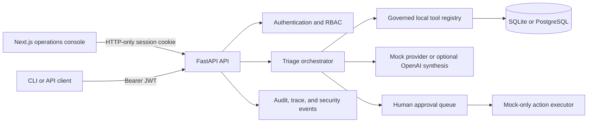

# Enterprise AI Incident Triage & Automation Agent

When an alert fires, SREs and incident commanders need a defensible next step, not another opaque summary. This local-first operations console turns synthetic alerts, logs, runbooks, service changes, and related incidents into a traceable triage workflow: it gathers governed evidence, proposes a root-cause hypothesis and response plan, then creates approval-gated **mock** actions for review.

The product is designed to make the reasoning visible. An operator can follow the evidence behind a severity decision, inspect every tool call and trace step, review drafts in an approval queue, and leave with a generated incident report. It is a portfolio/reference implementation, not a production incident-management service: no real Jira, Slack, PagerDuty, GitHub, or infrastructure action is performed.

## The product flow

1. An engineer opens a seeded incident and sees the alert timeline, service context, and redacted evidence.
2. The triage workflow classifies severity, searches approved local tools, and records its trace, hypotheses, and remediation plan.
3. It produces ticket and status-update drafts rather than sending anything.
4. An incident commander reviews the pending request and approves or rejects it.
5. An approved request creates a locally recorded `MOCK-*` result, plus timeline and audit entries for the report.

For a guided walkthrough, see the [demo script](docs/demo-script.md) and [agent workflow](docs/agent-workflow.md).

## What an operator can do

| Surface | Product value |
| --- | --- |
| Incident command center | Inspect alerts, health, runbooks, recent changes, related incidents, and the live timeline in one workspace. |
| Triage run and trace viewer | Review severity, evidence, scored root-cause hypotheses, remediation proposals, and each persisted workflow step. |
| Governed tools | Search redacted logs, check deterministic service health, read runbooks, inspect changes, and draft communications through a role-aware registry. |
| Approval queue | Let the appropriate operator review ticket, status, escalation, and resolution drafts before the mock executor records an outcome. |
| Operations views | Browse runbooks, tool policy, evaluation runs, reports, audit events, security findings, and system health. |

The console supports `viewer`, `engineer`, `incident_commander`, and `admin` roles. Role-aware navigation helps people find their workspace; FastAPI enforces the actual permission checks.

## Architecture



The backend owns authorization, tool policy, approval state, provider credentials, and audit records. The frontend is an operations surface, not a security boundary. Redis is included in the local stack and configuration, but the current application does not use it for distributed rate limiting or job execution. See the fuller [architecture notes](docs/architecture.md) and [tool-governance guide](docs/tool-governance.md).

## Tech stack

- **Experience:** Next.js 16, React 19, TypeScript, Tailwind CSS, and Lucide.
- **Application:** Python 3.11+, FastAPI, Pydantic, SQLAlchemy, Alembic, and Uvicorn.
- **Local services:** PostgreSQL 16, Redis 7, SQLite for direct local development, and Docker Compose.
- **AI and safety:** deterministic mock synthesis by default, optional OpenAI Responses API synthesis, redaction, prompt-injection detection, tool allowlisting, and persisted traces.
- **Quality gates:** Ruff, mypy, pytest, frontend type checking/build, npm high-severity audit, deterministic evaluations, health smoke test, and Compose validation.

## Run the deterministic demo

The default path is fully local and makes no paid provider calls. It starts with synthetic data and mock synthesis.

```bash
cp .env.example .env
docker compose up --build
```

Open [http://localhost:3000](http://localhost:3000). The API is available at [http://localhost:8000](http://localhost:8000), with OpenAPI documentation at [http://localhost:8000/docs](http://localhost:8000/docs). Demo identities and the local-only password are defined in `backend/app/services/seed.py`; the login interface intentionally does not display or prefill them.

To stop the stack:

```bash
docker compose down
```

To run services without Docker, start the backend first:

```bash
cp .env.example .env
python3 -m venv .venv
source .venv/bin/activate
python -m pip install -e './backend[dev]'
cd backend && python -m app.scripts.migrate && python -m app.scripts.seed
uvicorn app.main:app --reload --port 8000
```

Then, in another terminal:

```bash
cd frontend
npm install
npm run dev
```

## Product decisions that keep the demo honest

### Evidence before automation

The workflow persists its state, tool calls, approval IDs, risk findings, and trace steps. Redacted log search and suspicious-runbook findings give operators context without treating retrieved text as an instruction to act.

### Reviewable drafts, not hidden side effects

Ticket creation, status messages, escalation, and resolution are local representations. They require approval and return a `MOCK-*` identifier. The repository deliberately has no live external connector.

### A useful demo without a provider key

`LLM_PROVIDER=mock` is the default. It is deterministic, makes no network calls, and powers tests and CI. Optional OpenAI synthesis only runs when both `LLM_PROVIDER=openai` and `OPENAI_API_KEY` are supplied. If that configuration is incomplete or a request fails, the application returns a clearly labeled mock/failure result rather than claiming live inference.

```bash
LLM_PROVIDER=openai
OPENAI_API_KEY=...
```

`MAX_OUTPUT_TOKENS` and `LLM_TEMPERATURE` bound synthesis behavior. They are not a monetary budget; live use also needs provider-side budgets and monitoring. See [future real integrations](docs/future-real-integrations.md) for the boundary between this demo and a production connector.

## Evaluation and testing

Run the complete local verification gate after installing backend and frontend dependencies:

```bash
make verify
```

It runs backend linting, type checks, tests, frontend type checking and build, high-severity dependency audit, deterministic evaluations, and a health smoke test. Compose validation is also available:

```bash
docker compose config --quiet
```

The deterministic evaluation runner records evidence for redaction, prompt-injection detection, and approval-gate behavior. It is a focused regression suite, not evidence of production model quality or incident reliability. Individual commands and expected coverage are documented in the [evaluation guide](docs/evaluation.md).

## Governance, security, and limits

- Browser sessions are HTTP-only and `SameSite=Strict`; deliberate API clients can use bearer tokens. Cookie-authenticated writes require a trusted origin.
- Tools are registered and governed by minimum role, enablement, approval requirement, timeout, and configured rate-limit values. The configured rate limit is not yet a distributed enforcement mechanism.
- Production startup requires a private 32+ character `JWT_SECRET`; only explicit local/test demo mode may generate an ephemeral key.
- Stored agent runs, tool calls, approvals, timelines, security events, and admin changes support review. Raw source rows still need appropriate access and retention controls.
- The system intentionally omits enterprise identity, MFA, real connectors, server-side token revocation, queue workers, high availability, and broad real-incident evaluation.

Read the [security model](docs/security.md), [threat model](security/threat_model.md), and [observability notes](docs/observability.md) before adapting the project. Do not attach this demo directly to production incident tooling without scoped identities, tenant isolation, idempotency, rollback semantics, enforced quotas, connector-specific policy, and an adversarial security review.

## Repository map

```text
backend/app/       API, auth, agent workflow, tools, persistence, and security
backend/tests/     API, RBAC, tool, agent, and provider regression tests
frontend/          Next.js operations console
docs/              Architecture, API, governance, evaluation, demo, and ops notes
security/          Threat model
docker-compose.yml Local PostgreSQL, Redis, API, and UI stack
```

Start with the [architecture](docs/architecture.md), [workflow](docs/agent-workflow.md), [API](docs/api.md), and [local-development guide](docs/local-development.md).
