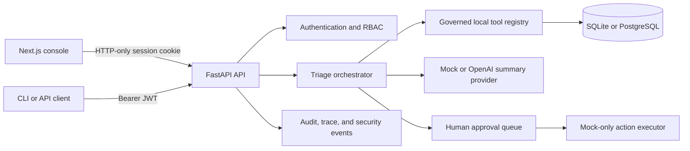

# Enterprise AI Incident Triage & Automation Agent

A local-first incident-response reference application that turns alerts, logs, runbooks, service changes, and related incidents into an evidence-backed triage workflow. The agent can search governed tools, build a hypothesis, draft communications, request approval, and execute **mock** external actions while recording its trace and audit history.

This repository is a portfolio-grade system, not a production incident-management service. Its default mode is deterministic, works without paid APIs, and never modifies a real ticketing, paging, chat, or infrastructure system.

## What it demonstrates

- FastAPI API with SQLAlchemy persistence and Alembic migrations.
- Next.js operations console for incidents, tools, runs, approvals, reports, evals, and administration.
- Four-level RBAC: `viewer`, `engineer`, `incident_commander`, and `admin`.
- HTTP-only browser sessions plus bearer-token compatibility for non-browser API clients.
- Tool allowlisting, minimum-role checks, enable/disable controls, approval gates, timeouts, and audit records.
- Secret/PII redaction and prompt-injection detection on untrusted runbook content.
- Deterministic mock triage, stored evaluation cases, and optional bounded OpenAI synthesis.
- Human approval before every simulated external action.

## Architecture



The backend owns authorization, tool policy, approval state, and provider credentials. The UI is not a security boundary. Redis is included in the local stack and surfaced as configured, but the current application does not yet use it for distributed rate limiting or job execution.

## Security model

### Authentication and sessions

- Passwords are bcrypt-hashed through Passlib.
- JWT signing has no repository fallback secret. Outside explicit local/test demo mode, startup fails unless `JWT_SECRET` is at least 32 characters.
- `LOCAL_DEMO_MODE=true` is permitted only with `APP_ENV=local|test`; it may generate an ephemeral signing key when no key is supplied.
- Browser login sets an `HttpOnly`, `SameSite=Strict` session cookie. Production-mode cookies also set `Secure`.
- The frontend sends cookies with requests and never stores bearer credentials in `localStorage`.
- Cookie-authenticated writes reject missing or untrusted browser origins. CORS uses the explicit `CORS_ORIGINS` allowlist.
- Login still returns a bearer token for deliberate CLI/API use. Treat it as a secret and do not persist it in browser JavaScript.

### Roles

| Role | Intended access |
| --- | --- |
| `viewer` | Read incidents, services, reports, and low-risk details |
| `engineer` | Create incidents/alerts, search evidence, and run permitted diagnostic tools |
| `incident_commander` | Update incident state, request/review operational actions, and manage runbooks |
| `admin` | Governance, eval execution, security/audit data, analytics, and user visibility |

Every protected API route enforces its role server-side. Navigation filtering is only a usability aid.

### Agent and tool controls

- Only seeded/registered tools can execute.
- Each tool carries a minimum permission, risk label, enabled state, approval requirement, timeout, and configured rate-limit value.
- Log search returns redacted content; suspicious runbook instructions create security findings.
- Ticket creation, status messages, escalation, and resolution are represented locally and require approval.
- “Execution” produces a `MOCK-*` identifier. There is no real Jira, Slack, PagerDuty, or infrastructure connector.
- Agent runs, tool calls, approvals, timeline entries, security events, and admin changes are persisted for review.

See [docs/security.md](docs/security.md), [security/threat_model.md](security/threat_model.md), and [docs/tool-governance.md](docs/tool-governance.md).

## Quick start: deterministic local demo

Prerequisites: Docker Desktop with Compose.

```bash
cp .env.example .env
docker compose up --build
```

Open `http://localhost:3000`. The API is at `http://localhost:8000` and its OpenAPI UI at `http://localhost:8000/docs`.

The example environment explicitly enables local demo mode and deterministic seeding. Demo identities and the local-only password live in `backend/app/services/seed.py`; the production login form intentionally does not display or prefill them. Never deploy `.env.example` unchanged.

Stop the stack with:

```bash
docker compose down
```

### Local processes without Docker

```bash
cp .env.example .env
python3 -m venv .venv
source .venv/bin/activate
python -m pip install -e './backend[dev]'
cd backend && python -m app.scripts.migrate && python -m app.scripts.seed
uvicorn app.main:app --reload --port 8000
```

In a second terminal:

```bash
cd frontend
npm install
npm run dev
```

For a non-demo environment set `APP_ENV=production`, `LOCAL_DEMO_MODE=false`, `AUTO_SEED=false`, a private 32+ character `JWT_SECRET`, production CORS origins, and a production database URL.

## Mock and live provider behavior

`LLM_PROVIDER=mock` is the default. It is deterministic, makes no network calls, and is used by tests and CI.

Optional OpenAI synthesis is enabled only when both of these are set:

```bash
LLM_PROVIDER=openai
OPENAI_API_KEY=...
```

The provider submits only the assembled incident evidence to the configured Responses API model. `MAX_OUTPUT_TOKENS` and `LLM_TEMPERATURE` bound output behavior. If OpenAI mode is requested without a key, or the request fails, the code returns a clearly labeled mock/failure result instead of claiming a successful live inference.

Cost controls:

- CI and normal verification use mock mode only.
- No background live calls are scheduled.
- Live use requires an operator-supplied key and explicit provider selection.
- `MAX_OUTPUT_TOKENS` bounds each synthesis response, but the repository does **not** implement a hard monetary budget. Set provider-side project budgets and monitor usage before live use.

## Verification

Install backend and frontend dependencies first, then run:

```bash
make verify
```

The aggregate gate runs backend lint, mypy, pytest, frontend typecheck/build, `npm audit --audit-level=high`, deterministic evals, the health smoke test, and Compose validation.

Individual gates:

```bash
make backend-lint
make backend-typecheck
make backend-test
make frontend-typecheck
make frontend-build
make frontend-audit
make evals
make smoke-test
docker compose config --quiet
```

Authentication/RBAC tests cover bearer and cookie sessions, least-privilege registration, protected routes, role denial, fail-closed production secret configuration, untrusted-origin rejection, and browser-source regressions such as token persistence or credential prefilling.

The deterministic eval runner stores evidence for redaction, prompt-injection detection, and approval-gate behavior. It is a focused safety regression suite, not a claim of model quality or production reliability.

## Operations

- Health: `GET /health` confirms API process health.
- System health: `GET /admin/system-health` requires admin and reports database access plus configured components.
- Audit and security views are admin-only.
- Generated incident reports are written beneath `REPORT_OUTPUT_DIR`; protect and retain that directory according to your data policy.
- Apply Alembic migrations before serving a shared database.
- Rotate `JWT_SECRET` using an operational plan; rotation invalidates existing sessions.
- Terminate TLS at a trusted ingress and keep backend/frontend on the same schemeful site when using strict cookies.

## Threat model summary

| Threat | Current control | Remaining risk |
| --- | --- | --- |
| Stolen browser token via XSS | HTTP-only cookie; no Web Storage token | XSS can still act as the signed-in user; deploy CSP and harden dependencies |
| CSRF | Strict SameSite cookie and trusted-origin check on cookie-authenticated writes | Same-site compromise and proxy origin rewriting need deployment review |
| Weak/default signing key | Startup validation; ephemeral key only in explicit local/test demo | Secret rotation and centralized secret storage are operator responsibilities |
| Privilege escalation | Server-side RBAC; registration always creates `viewer` | No enterprise IdP, MFA, or account lifecycle workflow |
| Prompt injection in runbooks | Pattern detection, trust metadata, approval gates | Heuristic detection is bypassable; never treat it as a complete classifier |
| Sensitive data in evidence | Redaction before tool output/reporting | Raw source rows remain in the database and require access/retention controls |
| Unsafe automation | Allowlist, role checks, human approval, mock executors | Real connectors would need scoped credentials, idempotency, rollback, and connector-specific policy |
| Cost runaway | Mock-by-default, explicit live enablement, output-token cap | No hard spend ledger or request quota enforcement |

## Known limitations

- The action layer is intentionally mock-only.
- Demo data is synthetic and is not representative of production incident distributions.
- JWTs have expiry but no server-side revocation list or refresh-token rotation.
- Local email/password auth is not a replacement for SSO/MFA.
- The configured tool rate-limit field and Redis service are not yet enforced as a distributed control.
- Evaluation coverage is deterministic and narrow; it does not measure hallucination rate across real incidents.
- Horizontal scaling, queue workers, HA database design, backup/restore, and production telemetry export are out of scope.

## Repository map

```text
backend/app/       API, auth, agent workflow, tools, persistence, security
backend/tests/     API, RBAC, tool, agent, and provider regression tests
frontend/          Next.js operations console
docs/              Architecture, API, governance, evaluation, demo, and ops notes
security/          Threat model
docker-compose.yml Local PostgreSQL, Redis, API, and UI stack
```

Start with [docs/architecture.md](docs/architecture.md), [docs/agent-workflow.md](docs/agent-workflow.md), [docs/api.md](docs/api.md), and [docs/local-development.md](docs/local-development.md).

## Responsible use

Do not connect this demo directly to production incident tooling. Before adding real actions, require scoped service identities, tenant isolation, idempotency, change-management approval, connector-level audit evidence, rate enforcement, rollback semantics, and an adversarial security review.
