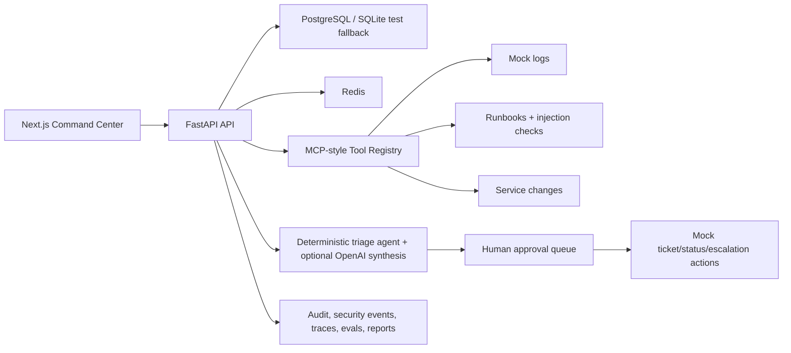

# Enterprise AI Incident Triage & Automation Agent

Local-first enterprise incident response platform for AI engineering, GenAI, DevOps AI, SRE automation, platform engineering, and LLMOps portfolios.

The system receives incident alerts, classifies severity, searches redacted logs and runbooks through MCP-style tools, checks service health and recent changes, finds related incidents, generates root cause hypotheses, drafts remediation/ticket/status-update artifacts, gates mock external actions behind human approval, stores traces/audit logs, and exposes reports, evaluations, observability, governance, and security dashboards.

## Why This Project Matters

Recruiters from AI companies can inspect a complete product, not a notebook demo. The repo shows backend engineering, agent workflow design, local security controls, RBAC, MCP-style tool governance, deterministic evaluation, observability, Docker-based local operations, CI, tests, and a polished command-center UI.

## Tech Stack

- Backend: FastAPI, Pydantic v2, SQLAlchemy 2, Alembic, JWT, Passlib, LangGraph dependency, OpenTelemetry-style local metrics hooks, optional OpenAI Responses API provider.
- Frontend: Next.js, TypeScript, Tailwind CSS, lucide-react.
- Data: PostgreSQL in Docker Compose, Redis for local cache/rate-limit readiness, SQLite fallback for quick local tests.
- Local ops: Docker Compose, Makefile, seed scripts, pytest, ruff, mypy, GitHub Actions.

## Architecture



## Local Setup

1. Copy `.env.example` to `.env` if you want to customize values. Keep `LLM_PROVIDER=mock` for the fully deterministic demo.
2. Start all services:

```bash
docker compose up --build
```

3. Open `http://localhost:3000` and sign in with:

```text
admin@example.com / LocalDemoPass123!
commander@example.com / LocalDemoPass123!
engineer@example.com / LocalDemoPass123!
viewer@example.com / LocalDemoPass123!
```

## Migrations and Seed Data

```bash
make migrate
make seed
```

The seed creates demo users, checkout-api incidents, alerts, redacted logs, runbooks including a suspicious prompt-injection case, service changes, related incidents, and the MCP-style tool registry.

## Run the Incident Agent

1. Log in as `commander@example.com` or `admin@example.com`.
2. Open Incidents.
3. Select `Checkout API payment timeout spike`.
4. Click `Run agent`.
5. Inspect trace steps, root cause output, pending approvals, tool calls, and timeline events.

## OpenAI API Option

The app works without OpenAI. To use OpenAI synthesis for the agent summary:

```env
LLM_PROVIDER=openai
OPENAI_API_KEY=sk-...
OPENAI_CHAT_MODEL=gpt-5
```

Tests and CI keep `LLM_PROVIDER=mock` and never require paid API calls. The provider uses the OpenAI Responses API according to the official OpenAI docs.

## MCP-Style Tools

Tools are registered with name, description, input/output schemas, permission level, risk level, enable/disable state, approval requirement, timeout, and rate limit settings. Every call is permission-checked, persisted, and audited.

Implemented tools:

- `search-logs`
- `search-runbooks`
- `get-incident-details`
- `get-service-health`
- `list-recent-service-changes`
- `get-related-incidents`
- `create-ticket-draft`
- `draft-status-update`

## Human Approval

Ticket creation, status updates, escalation, and other external-facing actions are local mock actions. They require incident commander or admin approval before execution. Rejections prevent execution and create audit/timeline records.

## Security Controls

- JWT authentication and role-based access.
- Sensitive log redaction for tokens, API keys, passwords, bearer tokens, and email addresses.
- Runbook prompt-injection detection for instructions that attempt to bypass policy, reveal hidden prompts, or disable controls.
- Tool allowlist and role checks.
- Audit logs and security events.
- Reports use redacted evidence.

## Reports, Evaluations, and Observability

Incident reports are generated as local Markdown files under `reports/`. Evaluations test redaction, prompt-injection detection, and approval-gate behavior with deterministic local cases. Admin observability computes counts, tool success rate, average latency, pending approvals, agent run totals, and security events.

## Tests

```bash
make backend-test
make backend-lint
make backend-typecheck
make frontend-typecheck
make frontend-build
make evals
make smoke-test
make verify
```

## Known Limitations

- External Slack, Jira, GitHub, PagerDuty, Datadog, and log-ingestion systems are intentionally mocked.
- The local MCP-style registry is designed for adaptation to official MCP servers but does not call real enterprise systems.
- The product is local-first and not production infrastructure.

## Intentionally Not Included

No Supabase, cloud hosting, billing, payments, enterprise SSO, Kubernetes, Terraform, Pulumi, production Slack/Jira/GitHub/PagerDuty calls, or real production incident actions.

## Future Real Integrations

See [docs/future-real-integrations.md](docs/future-real-integrations.md). Real integrations should be added only after stronger secrets management, tenant isolation, rate limiting, egress policy, staged rollout, and approval/audit enforcement are in place.

## Resume Bullets

- Built a local-first enterprise AI incident triage platform with FastAPI, Next.js, PostgreSQL, Redis, JWT RBAC, MCP-style tools, and deterministic agent workflows.
- Implemented human approval gates, audit logs, sensitive data redaction, prompt-injection detection, tool governance, incident reports, evals, and observability dashboards.
- Designed an AI DevOps/SRE automation architecture that can replace mock actions with real Slack, Jira, GitHub, PagerDuty, and observability integrations later.

## Demo Script

Use [docs/demo-script.md](docs/demo-script.md) for a 3-5 minute recruiter walkthrough.

