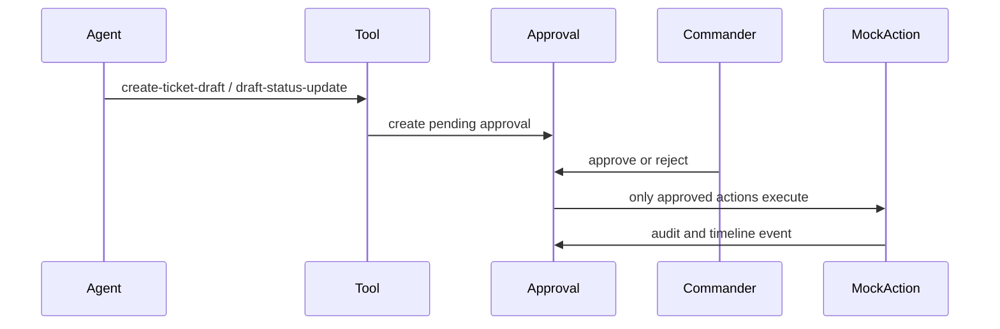

# Architecture

The repository is a local-first monorepo with a FastAPI backend, Next.js frontend, PostgreSQL, Redis, deterministic seed data, MCP-style tools, and an incident triage agent.

Backend layers:

- `app/api` style routes live in `app/main.py` for this compact local build.
- `app/db` owns SQLAlchemy models and session setup.
- `app/mcp` owns tool registry execution and governance enforcement.
- `app/security` owns redaction and prompt-injection detection.
- `app/services` owns audit/timeline/seed/LLM provider services.

Frontend layers:

- App Router pages provide dashboards and workflow screens.
- `components` contains app shell, panels, tables, metrics, and status pills.
- `lib/api.ts` centralizes authenticated API calls.

Database surfaces include users, services, incidents, alerts, logs, runbooks, service changes, related incidents, tickets, notifications, MCP tools, tool calls, agent runs, trace steps, hypotheses, remediation plans, approvals, timelines, reports, evals, audit logs, security events, and system metrics.

LangGraph is included as a dependency for agentic architecture alignment. The current workflow is deterministic and persisted through trace steps so local tests and demos do not depend on paid calls.

Human approval flow:

Evaluation flow runs deterministic local cases for redaction, prompt injection, and approval gates, then stores metrics for the dashboard.
